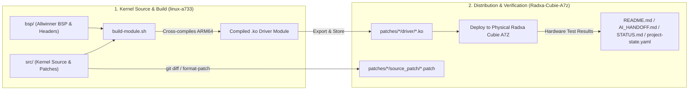

# Workspace Overview & Architecture Guide

This document explains the organization, purpose, and contents of the two main workspace directories:
1. **[`Radxa-Cubie-A7z`](file:///workspaces/Radxa-Cubie-A7z)** — Operational release hub, verified driver binaries, patches, and hardware documentation.
2. **[`linux-a733`](file:///workspaces/linux-a733)** — Canonical Linux 5.15 kernel superproject, Allwinner BSP source code, board definitions, and cross-compilation toolchain scripts.

---

## 🗺️ High-Level Workspace Architecture

```
/workspaces/
│
├── 📦 Radxa-Cubie-A7z/             <- Release Hub & Hardware Documentation (Operational Repo)
│   ├── .config                     <- Reference kernel .config matching target OS image
│   ├── project-state.yaml          <- Machine-readable validation status, SHA256 hashes & parameters
│   ├── README.md                   <- Repository landing page, target specs & quick-start index
│   ├── BUILD.md                    <- Detailed kernel cross-compilation guide & symbol troubleshooting
│   ├── AI_HANDOFF.md               <- Full project continuity memory & driver development history
│   ├── WORKSPACE_OVERVIEW.md       <- This architectural summary document
│   └── patches/                    <- Clean, isolated patch subprojects with precompiled binaries
│       ├── mt7601u-ap-mode/        <- MediaTek MT7601U AP/Hotspot driver subproject (VERIFIED WORKING)
│       └── aic8800d80-monitor-mode/<- AIC8800D80 Wi-Fi monitor mode & packet injection subproject
│
└── 🛠️ linux-a733/                  <- Linux Kernel Superproject & Source Tree (Build Repo)
    ├── src/                        <- Linux 5.15.147 kernel source tree (submodule)
    ├── bsp/                        <- Allwinner BSP drivers, headers, and platform support (submodule)
    ├── device-a733/                <- Board defconfigs, overlays, and device trees (submodule)
    ├── debian/                     <- Debian packaging scripts for building .deb kernel releases
    ├── build-module.sh             <- Reusable cross-compilation script for building standalone .ko modules
    ├── Makefile / Makefile.extra   <- Build targets (make pre_build, make deb, etc.)
    └── devenv.nix / devenv.yaml    <- Reproducible developer environment configuration
```

---

## 1. 📦 `Radxa-Cubie-A7z` (Release & Operational Hub)

### Purpose
`Radxa-Cubie-A7z` is designed to be the **operational hub and release database** for custom hardware enablement on the **Radxa Cubie A7Z** (powered by the Allwinner A733 / `sun60iw2p1` octa-core ARM64 SoC). It stores ready-to-deploy `.ko` kernel modules, patch files, deployment guides, and records of real-world hardware verification.

### File & Directory Breakdown

| File / Folder | Role & Description |
| :--- | :--- |
| [`.config`](file:///workspaces/Radxa-Cubie-A7z/.config) | Reference Linux 5.15.147 kernel configuration matching the stock Radxa Debian image on the Cubie A7Z. Includes customizations like `CONFIG_MT7601U=m` with NUMA disabled to prevent symbol mismatch. |
| [`project-state.yaml`](file:///workspaces/Radxa-Cubie-A7z/project-state.yaml) | Machine-readable single source of truth tracking board specs, verified features, unverified features, known error codes (e.g. `-71 EPROTO`, `-16 EBUSY`), and SHA256 checksums of validated binaries. |
| [`README.md`](file:///workspaces/Radxa-Cubie-A7z/README.md) | Central documentation landing page covering hardware specifications, need/purpose, directory map, and the subproject catalog. |
| [`BUILD.md`](file:///workspaces/Radxa-Cubie-A7z/BUILD.md) | Comprehensive engineering guide on how to cross-compile kernel modules, set up environment variables (`ARCH`, `CROSS_COMPILE`, `HOSTCC`, `BSP_TOP`), resolve symbol table (`vmlinux.symvers`) dependencies, and avoid `vermagic` mismatch issues. |
| [`AI_HANDOFF.md`](file:///workspaces/Radxa-Cubie-A7z/AI_HANDOFF.md) | In-depth project memory designed for seamless developer/AI onboarding. Details the reverse engineering, hardware beacon memory mapping (`0xC000`), timer synchronization, and mac80211 integration for MT7601U AP mode. |
| [`WORKSPACE_OVERVIEW.md`](file:///workspaces/Radxa-Cubie-A7z/WORKSPACE_OVERVIEW.md) | This document explaining both repositories and their roles. |

### Subproject Directories in `patches/`

#### A. [`patches/mt7601u-ap-mode/`](file:///workspaces/Radxa-Cubie-A7z/patches/mt7601u-ap-mode)
* **Goal:** Implement Access Point (AP / Hotspot / `hostapd`) functionality for MediaTek MT7601U USB Wi-Fi dongles (`148f:7601`).
* **Status:** **VERIFIED WORKING** on physical Radxa Cubie A7Z hardware.
* **Key Components:**
  * `driver/mt7601u.ko`: Verified, drop-in kernel module binary matching vermagic `5.15.147-21-a733 SMP preempt mod_unload aarch64` (SHA256: `2c83f127c331a6ee0c35f7323e13b2491f287a2c4abf08220f79644a7b760833`).
  * `source_patch/mt7601u-enable-ap-mode.patch`: Clean unified diff modifying `init.c`, `mac.c`, `mac.h`, `main.c`, `mt7601u.h`, and `regs.h`.
  * `INSTALL.md`: Step-by-step target installation and `hostapd.conf` launch instructions.
  * `STATUS.md`: Authoritative verification logs with raw `hostapd` output, probe requests/responses, and beacon reception.
  * `BUILD.md` & `BUILD_NOTES.md`: Compilation commands and kernel configuration parameters.
  * `CHANGELOG.md`: Version iterations and technical changelog.

#### B. [`patches/aic8800d80-monitor-mode/`](file:///workspaces/Radxa-Cubie-A7z/patches/aic8800d80-monitor-mode)
* **Goal:** Enable monitor mode, packet capture, and frame injection tracing on the onboard AIC8800D80 Wi-Fi chipset.
* **Status:** **READY / TESTING**
* **Key Components:**
  * `driver/aic8800_fdrv.ko` & `driver/aic_load_fw.ko`: Prebuilt kernel modules for the AIC8800 driver and firmware loader.
  * `source_patch/`: Patches implementing monitor mode hooks and debug instrumentation.
  * `INSTALL.md`, `BUILD.md`, `CHANGELOG.md`, `README.deploy.md`: Deployment and testing procedures.

---

## 2. 🛠️ `linux-a733` (Kernel Superproject & Source)

### Purpose
`linux-a733` is the official **Radxa Linux Kernel Superproject** for the Allwinner A733 SoC platform. It contains the upstream/vendor kernel source code, out-of-tree BSP drivers, defconfigs, packaging infrastructure, and automation scripts to build complete Debian kernel packages (`.deb`) or individual standalone kernel modules (`.ko`).

### Submodules & Components Breakdown

| Directory / File | Submodule / Role | Description |
| :--- | :--- | :--- |
| [`src/`](file:///workspaces/linux-a733/src) | Linux Kernel Tree (Submodule) | Linux Kernel version `5.15.147` adapted for Allwinner ARM64 SoCs. Contains full kernel source (`arch/arm64`, `drivers/net/wireless`, `fs`, `kernel`, etc.). Active development branches (e.g. `mt7601u-ap-experiment`) reside here. |
| [`bsp/`](file:///workspaces/linux-a733/bsp) | Allwinner BSP (Submodule) | Vendor Allwinner Board Support Package containing hardware IP drivers, headers, PMIC power management, audio/display engines, and USB host controller drivers. Linked into `src/bsp` via `make pre_build`. |
| [`device-a733/`](file:///workspaces/linux-a733/device-a733) | Device Defconfigs (Submodule) | Device-specific board configurations, device tree files (DTS/DTSI), boot resources, and `bsp.config` definitions for the A733 / Radxa Cubie A7Z. |
| [`debian/`](file:///workspaces/linux-a733/debian) | Debian Packaging | Debian packaging control files (`control`, `rules`, `changelog`, `patches`) used by `dpkg-buildpackage` / `make deb` to generate installable `.deb` packages for `linux-image` and `linux-headers`. |
| [`build-module.sh`](file:///workspaces/linux-a733/build-module.sh) | Build Automation Tool | Highly efficient script that compiles an individual in-tree or out-of-tree driver module without having to rebuild the entire kernel or generate Debian packages. Automatically ensures pre-build fixups, correct `.config`, and proper `vermagic` header settings. |
| [`Makefile`](file:///workspaces/linux-a733/Makefile) & [`Makefile.extra`](file:///workspaces/linux-a733/Makefile.extra) | Orchestration | Top-level Makefile providing key targets: `make pre_build` (sets up symlinks between `src` and `bsp`), `make build`, and `make deb`. |
| `devenv.nix`, `devenv.yaml`, `devenv.lock` | Dev Environment | Nix/devenv configuration files for reproducible toolchain dependencies. |

---

## 🔄 How the Two Repositories Work Together

The development workflow connects both repositories in a streamlined cycle:



### Typical Workflow:
1. **Develop / Patch:** Modify kernel or driver source inside [`linux-a733/src/`](file:///workspaces/linux-a733/src).
2. **Build Module:** Run `./build-module.sh <path_to_driver>` in [`linux-a733/`](file:///workspaces/linux-a733) to produce an ARM64 `.ko` binary with matching vermagic.
3. **Capture Patch & Binary:** Copy the resulting `.ko` binary into [`Radxa-Cubie-A7z/patches/<subproject>/driver/`](file:///workspaces/Radxa-Cubie-A7z/patches) and create a unified diff patch in `source_patch/`.
4. **Deploy & Validate:** Deploy the module to the Radxa Cubie A7Z board, run hardware tests (e.g. `hostapd`, Wi-Fi scanning), and record output in [`STATUS.md`](file:///workspaces/Radxa-Cubie-A7z/patches/mt7601u-ap-mode/STATUS.md) and [`project-state.yaml`](file:///workspaces/Radxa-Cubie-A7z/project-state.yaml).
