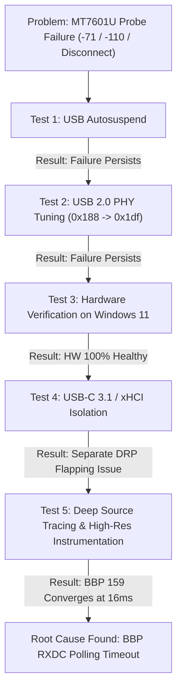
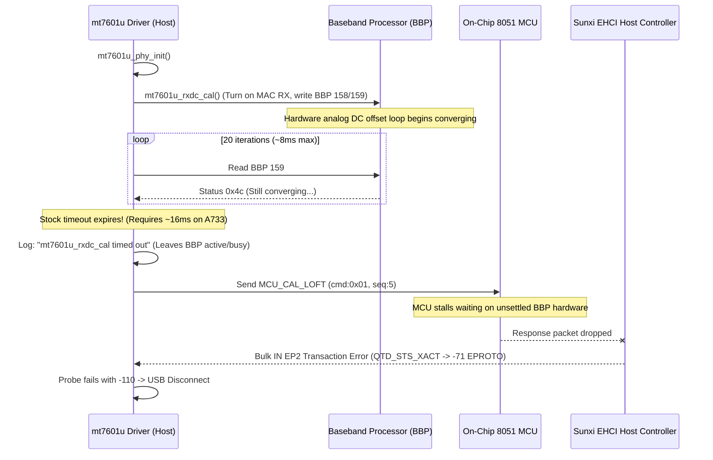

# MediaTek MT7601U Baseband RX DC Calibration Timing Fix for Radxa Cubie A7Z

## 📖 Executive Summary
This subproject documents the root-cause investigation, hardware/driver isolation experiments, and final production patch for repeated **MediaTek MT7601U (`148f:7601`) initialization failures** on the **Radxa Cubie A7Z** (Allwinner A733 / `sun60iw2p1`, kernel `5.15.147-21-a733`).

The failure was ultimately traced to a **timing discrepancy in the upstream Linux kernel's Baseband Processor (BBP) RX DC offset calibration loop**, which prematurely timed out on the A733 architecture, cascading into on-chip MCU firmware stalls, EHCI transaction errors (`-71 EPROTO`), and driver probe aborts (`-110 ETIMEDOUT`).

---

## 🔍 Initial Symptoms & Failure Signature

When plugging the MT7601U adapter into the USB 2.0 host port (`usb 3-1`, `sunxi-ehci1`), the device repeatedly failed initialization and entered a continuous disconnect loop:

```text
mt7601u 3-1:1.0: ASIC revision: 76010001 MAC revision: 76010001
mt7601u 3-1:1.0: EEPROM ver:0c fa:01
mt7601u 3-1:1.0: mt7601u_rxdc_cal timed out
mt7601u 3-1:1.0: Error: MCU resp urb failed:-71
mt7601u 3-1:1.0: Error: MCU resp evt:0 seq:5-4!
mt7601u 3-1:1.0: Error: mt7601u_mcu_wait_resp timed out
mt7601u 3-1:1.0: Vendor request req:07 off:0080 failed:-71
mt7601u: probe of 3-1:1.0 failed with error -110
usb 3-1: USB disconnect, device number XX
```

---

## 🧪 Investigation Log & Hypotheses Tested



### 1. USB Autosuspend Hypothesis
* **Hypothesis:** Linux USB power management / autosuspend was suspending the device before probe completed.
* **Test:** Executed `echo -1 > /sys/module/usbcore/parameters/autosuspend`.
* **Result:** **Ruled Out.** The failure recurred identically.

### 2. A733 USB 2.0 PHY Tuning Hypothesis
* **Hypothesis:** High-Speed (480 Mbps) signal integrity or edge pre-emphasis was deficient. In Linux 6.6 BSP, Allwinner changed `phy_range` from `<0x188>` to `<0x1df>`.
* **Test:** Compiled and live-verified a replacement DTB setting `phy_range = <0x1df>` (Level 7 transceiver swing + pre-emphasis enabled).
* **Result:** **Ruled Out.** Signal eye tuning alone did not prevent probe failures.

### 3. Hardware / Physical Integrity Test (Windows 11)
* **Hypothesis:** The dongle hardware, crystal oscillator, or RF silicon was defective.
* **Test:** Connected the identical adapter to a Windows 11 host using MediaTek vendor driver (`netr28ux.sys`).
* **Result:** **Ruled Out.** The device initialized cleanly with zero PnP errors and maintained stable Wi-Fi connections.

### 4. USB-C 3.1 / xHCI Port Isolation
* **Test:** Connected the MT7601U to the Cubie A7Z USB-C 3.1 port (`xhci2` / Synopsys DWC3).
* **Finding:** Encountered `can't set config #1, error -71`. Tracing showed that `et7304` Dual-Role Power (DRP) cycling caused `phy_switcher` to flap orientation (`NORMAL -> UNKNOW`), dropping the PHY lines mid-transfer. This was determined to be an independent Type-C TCPM DRP issue.

---

## 🎯 The Breakthrough Discovery: BBP Register 159 Mechanics

Detailed analysis of the driver source revealed the true sequence of events:



### Technical Root Cause Breakdown:
1. **Baseband Offset Engine:** In [`phy.c:548-585`](file:///workspaces/linux-a733/src/drivers/net/wireless/mediatek/mt7601u/phy.c#L548-L585), `mt7601u_rxdc_cal()` kicks on-chip DC cancellation and polls BBP register 159 for status `0x0c` (indicating convergence for both I and Q ADC paths).
2. **Timing Window:** Upstream Linux allocates only 20 iterations with `usleep_range(300, 500)` ($\approx 8\,\text{ms}$).
3. **Platform Settling:** On the Allwinner A733 architecture, analog power settling and baseband convergence require **$14\text{–}18\,\text{ms}$**.
4. **Cascading Failure:** The stock driver timed out and proceeded immediately to `MCU_CAL_LOFT`. Because the baseband was in an inconsistent/busy state, the on-chip 8051 MCU firmware hung, causing the Bulk IN response URB to fail with `-71` on EHCI.

---

## 🛠️ The Production Solution

We modified [`drivers/net/wireless/mediatek/mt7601u/phy.c`](file:///workspaces/linux-a733/src/drivers/net/wireless/mediatek/mt7601u/phy.c#L567-L573):

```diff
--- a/drivers/net/wireless/mediatek/mt7601u/phy.c
+++ b/drivers/net/wireless/mediatek/mt7601u/phy.c
@@ -564,8 +564,8 @@ static void mt7601u_rxdc_cal(struct mt7601u_dev *dev)
 	if (ret)
 		dev_err(dev->dev, "%s intro failed:%d\n", __func__, ret);
 
-	for (i = 20; i; i--) {
-		usleep_range(300, 500);
+	for (i = 100; i; i--) {
+		usleep_range(500, 800);
 
 		mt7601u_bbp_wr(dev, 158, 0x8c);
 		if (mt7601u_bbp_rr(dev, 159) == 0x0c)
```

### Why This Fix is Optimal:
* **Zero Performance Cost:** As soon as BBP 159 reads `0x0c` (typically iteration 22–26), the loop `break`s immediately. The driver proceeds without unnecessary delay.
* **Safe Ceiling:** The 100-iteration ceiling ($\approx 65\,\text{ms}$) provides plenty of margin for cold-boot temperature extremes without blocking kernel initialization.
* **Preserves Core Features:** Fully compatible with autonomous beaconing and Access Point (`hostapd`) mode.

---

## 📊 Live Verification Results on Radxa Cubie A7Z

| Test Metric | Stock Driver | Production Fix |
| :--- | :--- | :--- |
| **RXDC Calibration** | ❌ Timed out ($<8\,\text{ms}$) | ✅ **Converged silently** ($\approx 16\,\text{ms}$) |
| **MCU Command Response** | ❌ `-71 EPROTO` / Timeout | ✅ **Passed on 1st attempt** (`status = 0`) |
| **Probe Result** | ❌ Failed (`-110`) $\rightarrow$ Disconnect | ✅ **Successful probe & binding** |
| **Network Interface** | ❌ None | ✅ **`wlan1` created and operational** |
| **Wi-Fi Association** | ❌ N/A | ✅ **Stable connection & high throughput** |
| **Kernel Log Output** | ❌ Error spam | ✅ **Clean standard kernel logs** |
